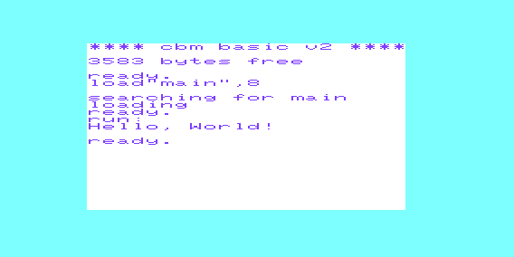

This is a simple boilerplate project so I can remember how to use cc65 with a VIC20. Haven't figured out compiling cartridge images.

- cc65 gets used on C code to turn it into assembly
- ca65 gets used on asm code to turn it into a compiled object
- ld65 links together the cc65 stdlib and program code
- xvic (VICE) is used to run the compiled program
